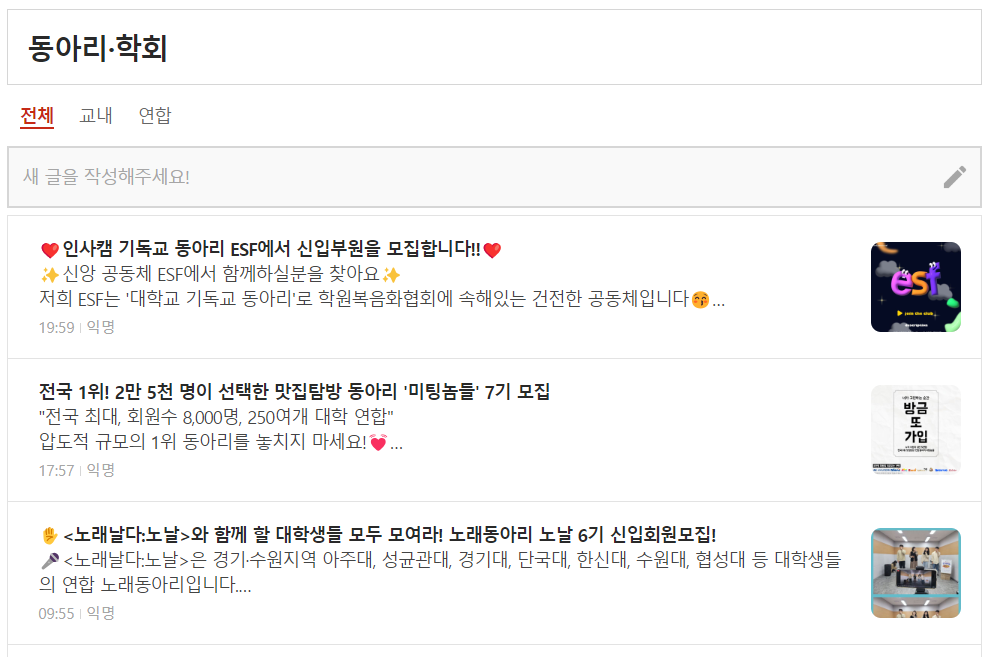
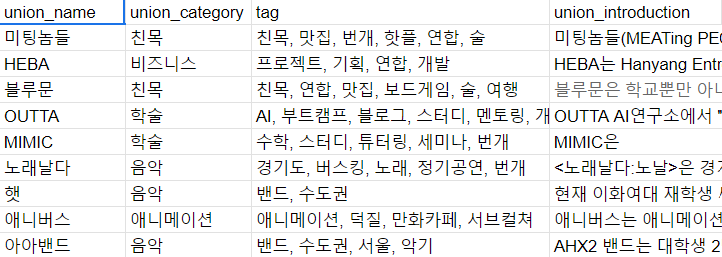
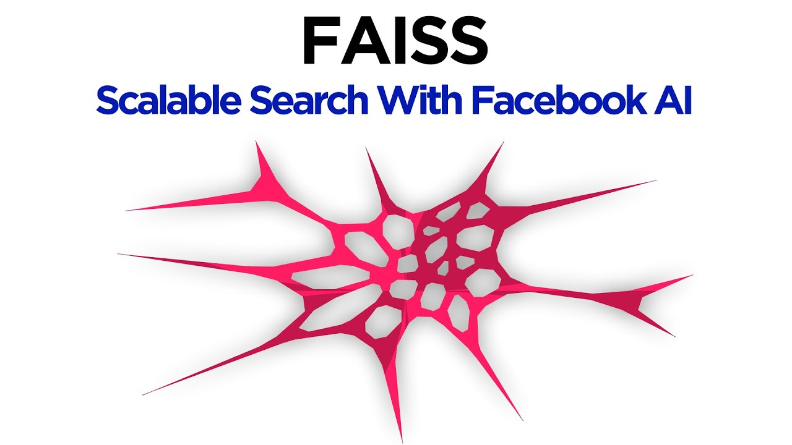
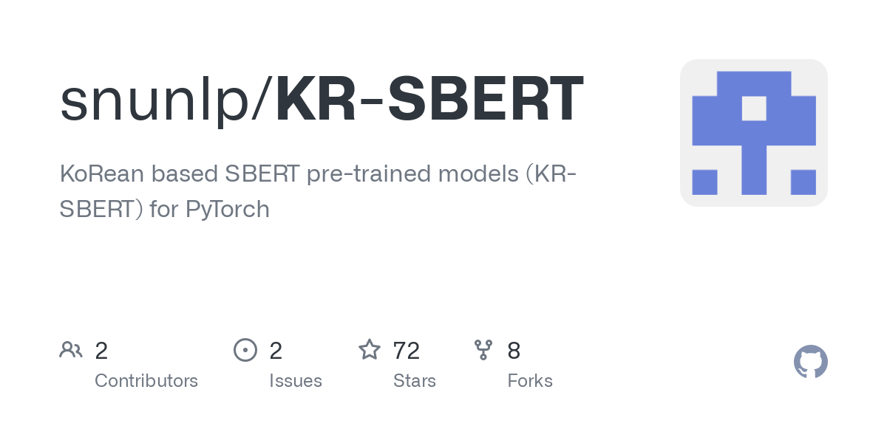
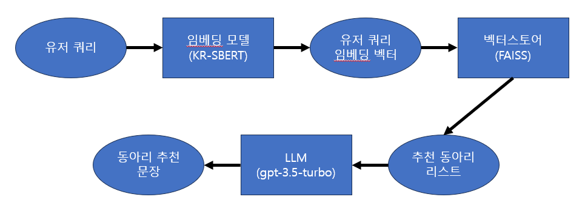
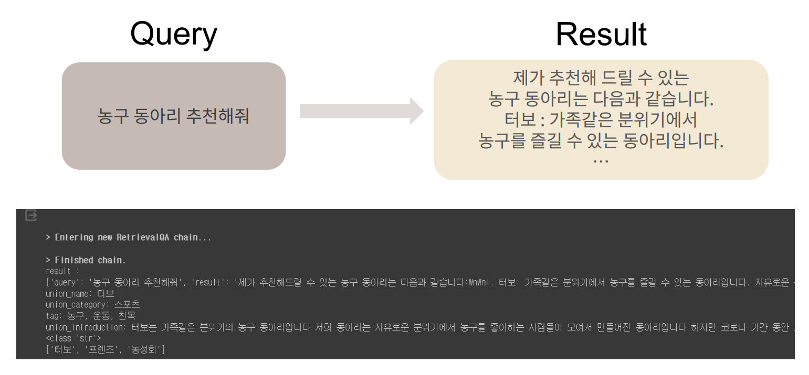

# 동아리 추천 챗봇 모델
유저가 추천받고 싶은 동아리의 특징을 입력하면, 적절한 동아리를 추천해주는 챗봇

## 👫 인공지능 팀 멤버
정성원, 김선규, 김호연

# Dataset
- 대학생 커뮤니티인 [에타(에브리타임)](https://everytime.kr/)의 동아리/학회 게시판에 올라와 있는 동아리 홍보글 400개 가량 수집하고, 동아리 추천에 필요하다고 생각되는 정보만 별도로 가공하여 사용.

- 23.07.31 ~ 23.10.01 사이에 업로드된 게시글을 수집.

### 데이터 가공 시 포함한 Column
- union_name : 동아리 이름
- union_category : 동아리가 속하는 카테고리
- tag : 동아리의 활동 내용, 종류 등의 정보를 담고 있는 태그 (여러 개를 사용할 수 있음)
- union_introduction : 동아리의 활동을 알려주는 소개문

# 프레임워크 및 라이브러리

### LangChain
- 챗봇 제작에 용이한 다양한 기능을 제공하는 프레임워크

### FAISS
- 벡터 간의 유사도 검색 기능을 제공하는 벡터스토어 라이브러리

# 임베딩 모델

### KR-SBERT (snunlp/KR-SBERT-V40K-klueNLI-augSTS)
- 동아리 데이터에 담긴 정보를 벡터화 하여 벡터 공간 상에 매칭시켜주는 모델

# 모델 구조도

### 시스템 플로우

1. 유저의 쿼리 입력
2. 입력된 쿼리를 임베딩 모델을 이용해 벡터로 변환
3. 변환된 유저 쿼리 벡터와 기존에 수집한 동아리 정보 벡터들간의 유사도 검색 진행
4. 유사도 검색의 결과로 유저 쿼리에 부합하는 추천 동아리 벡터 추출
5. 추천된 동아리의 정보를 LLM으로 넘겨 동아리 추천 문장 생성
6. 유저에게 동아리 추천 문장을 답변으로 제시

# 결과

